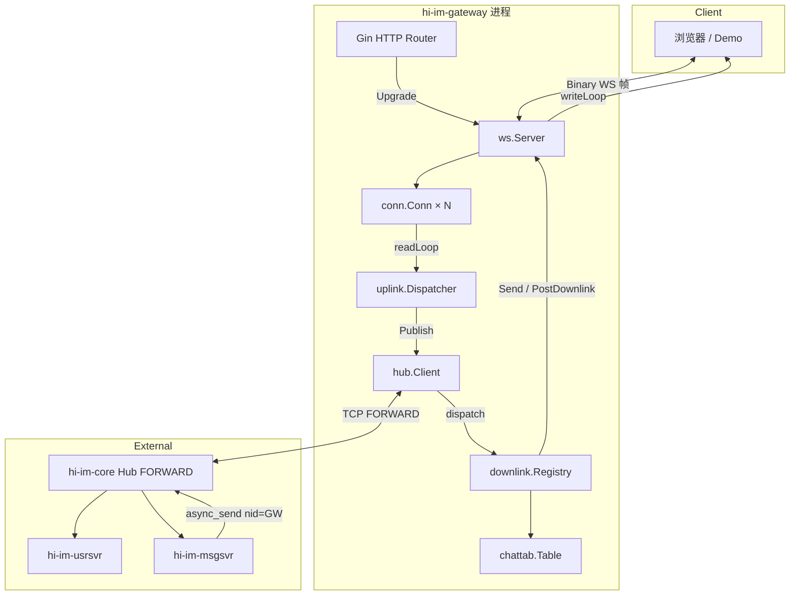

# hi-im-gateway 逻辑汇总

> 基于当前代码实现整理 · 2026-07-13  
> 对应仓库：`github.com/sunchao1/hi-im-gateway`

---

## 1. 项目定位

**hi-im-gateway** 是 hi-im 生态的 **WebSocket 接入层**，对标必嗨 `beehive-im/src/golang/exec/websocket`（LSND-WS）。

| 职责 | 说明 |
|------|------|
| WS 长连接 | 浏览器/客户端通过 WebSocket 建立二进制长连接 |
| 上行转发 | 客户端帧 → 填充 `cid/nid` → hubclient **FORWARD** `AsyncSend` → Hub publish → 后端业务 |
| 下行投递 | Hub `async_send` → gateway 注册 Handler → 查 ChatTab → 写回 WebSocket |
| 会话索引 | 进程内维护 `sid/cid ↔ Conn` 映射；群聊第二段 fan-out 依赖 **ImGroup** |

**边界（gateway 不做的事）：**

- HTTP 注册 / iplist → **hi-im-usrsvr**
- ONLINE 业务（token 校验、Redis、AllocSeq）→ **hi-im-usrsvr**
- 群聊第一段 fan-out（`gid→nid` 路由）→ **hi-im-msgsvr**
- Hub 实现 → **hi-im-core**

**数据平面：**

```text
浏览器 ──WS──► gateway ──hubclient FORWARD──► Hub.publish ──► usrsvr / msgsvr …
usrsvr ──hubclient BACKEND──► Hub.async_send(destNid=gatewayNid) ──► gateway ──WS──► 浏览器
```

gateway **只连接 FORWARD 平面**（`:28888`），不连接 BACKEND。

---

## 2. 整体架构



### 2.1 核心依赖

| 依赖 | 用途 |
|------|------|
| **hi-im-api** | 48B `MesgHeader` 编解码、protobuf、cmd 常量 |
| **hi-im-hubclient** | FORWARD 平面：上行 `AsyncSend`、下行 `RegisterHandler` |
| **gin** | HTTP 路由、健康检查、WS Upgrade 挂载 |
| **gorilla/websocket** | WebSocket 二进制帧读写 |

---

## 3. 启动流程

入口：`cmd/gateway/main.go`

```text
1. config.ConfigFromEnv()          加载 HIIM_* 环境变量
2. chattab.New()                   创建进程内会话表
3. hub.NewClient() + Start()       连接 Hub FORWARD，AUTH + SUB
4. hubClient.WaitReady()           等待握手完成（最多 30s）
5. uplink.NewDispatcher()          注册上行 Handler
6. ws.NewServer()                  启动 WS 服务 + downlinkLoop
7. downlink.NewRegistry()          注册下行 Handler 到 hubClient
8. imhttp.NewRouter()              Gin：/healthz、/readyz、/ws
9. http.ListenAndServe()           对外提供服务
10. SIGINT/SIGTERM → 优雅关闭 HTTP
```

**初始化循环依赖处理：** `kickAdapter` 打破 `uplink.Dispatcher` 与 `ws.Server.Kick` 之间的循环引用——先创建 adapter，再注入 `wsServer.Kick`。

---

## 4. 目录结构与模块职责

```text
cmd/gateway/main.go              进程入口、组件装配
internal/
├── config/config.go             HIIM_* 环境变量配置
├── conn/conn.go                 单连接状态：cid/sid/status/seq/writeC
├── chattab/
│   ├── session.go               sid/cid 会话索引（分片 999 桶）
│   └── imgroup.go               gid 成员表（群聊第二段 fan-out）
├── ws/
│   ├── server.go                WS 生命周期、read/write goroutine
│   ├── outbound.go              异步下行队列 downlinkLoop
│   └── uplink/
│       ├── dispatch.go          上行 cmd 路由
│       ├── online.go            CMD_ONLINE
│       ├── offline.go           CMD_OFFLINE
│       ├── ping.go              CMD_PING + 本地 PONG
│       └── comm.go              通用业务上行转发
├── hub/
│   ├── client.go                hubclient FORWARD 封装
│   └── downlink/
│       ├── dispatch.go          下行 Handler 注册表
│       ├── online_ack.go        CMD_ONLINE_ACK
│       ├── kick.go              CMD_KICK
│       ├── comm.go              通用下行转发
│       └── group_chat.go        GROUP-CREAT/JOIN ACK、GROUP-CHAT fan-out
├── http/
│   ├── router.go                Gin 路由
│   └── health.go                /healthz、/readyz
└── protocol/                    hi-im-api 尚未导出的 cmd 常量
```

---

## 5. 连接模型

### 5.1 连接标识

| 字段 | 来源 | 说明 |
|------|------|------|
| **cid** | gateway 分配 | 进程内唯一，单调递增 `atomic.Uint64` |
| **sid** | ONLINE 帧 header | 来自 usrsvr HTTP 注册 |
| **nid** | 配置 `HIIM_NID` | 本 gateway 实例在 Hub 中的节点 ID |

### 5.2 连接状态机

对齐必嗨 `LsndConnExtra`：

| 状态 | 含义 | 允许的操作 |
|------|------|------------|
| **READY** | WS 已建立，未 ONLINE | 接收 ONLINE |
| **CHECK** | ONLINE 已转发，等待 ACK | 等待 usrsvr 处理 |
| **LOGIN** | ONLINE_ACK 成功 | 业务上行、PING |
| **LOGOUT** | 主动/被动下线 | 关闭 WS |

状态流转：

```text
WS 建立 → READY
  → 收到 ONLINE → CHECK（SessionSetParam + FORWARD publish）
  → 收到 ONLINE_ACK(code=0) → LOGIN
  → OFFLINE / KICK / 异常断开 → LOGOUT → cleanup
```

### 5.3 并发模型（每连接）

```text
read goroutine   → raw.ReadMessage → uplink.Dispatcher.Handle
write goroutine  → conn.writeC → raw.WriteMessage（串行写，避免 concurrent write）
```

- 每连接写队列容量：**2048** 帧（`conn.writeC`）
- 连接上限：`HIIM_MAX_CONN`（默认 100000，软限）
- 写队列满时 `EnqueueWrite` 非阻塞返回 false，避免慢客户端拖垮下行

### 5.4 序列号（seq）

- `conn.SetSeq(seq)`：CAS 单调递增，防重放
- ONLINE_ACK 成功后用 `ack.seq` 初始化会话 seq
- seq 冲突时不踢线，调用 `InitSeq` 重同步（兼容 Demo 重连场景）

---

## 6. ChatTab 会话索引

`internal/chattab` 是进程内的 sid/cid 路由表，对标必嗨 `lib/chat_tab`。

### 6.1 Session 表

| API | 时机 | 作用 |
|-----|------|------|
| `SessionSetParam(sid, cid, conn)` | ONLINE 上行 | 绑定 sid+cid → Conn |
| `SessionGetParam(sid, cid)` | 下行投递 | 校验会话存在 |
| `GetCidBySid(sid)` | 下行 / 冲突检测 | 获取 sid 当前活跃 cid |
| `SessionSetCid(sid, cid)` | ONLINE_ACK 成功 | 更新 sid→cid 主映射 |
| `SessionFindBySid(sid)` | ONLINE_ACK | CHECK 态查找连接 |
| `SessionDel(sid, cid)` | 连接关闭 | 清理映射 |

分片策略：`sid % 999` 桶，降低锁竞争。

### 6.2 ImGroup 群成员表（M6）

| API | 时机 | 作用 |
|-----|------|------|
| `ImGroupJoin(gid, sid, cid)` | GROUP-CREAT/JOIN ACK 成功 | 记录 gid 成员 |
| `TravImGroupSession(gid, fn)` | GROUP-CHAT 下行 | 遍历 gid 所有本地连接 fan-out |
| `ImGroupQuit(gid, sid, cid)` | 退群 / 断连 | 移除成员 |

**为何需要 ImGroup：** 群聊下行帧 header 的 `sid` 通常是**发送方** sid，不能仅靠 `GetCidBySid` 单播；必须按 `gid` 遍历所有成员连接。

GID 来源：GROUP-CREAT/JOIN ACK 的 `errmsg` 字段，格式 `Ok:{gid}`。

---

## 7. 上行逻辑（Client → Hub）

路由入口：`internal/ws/uplink/dispatch.go`

```text
readLoop 收到 Binary 帧
  → header.Unmarshal（48B）
  → switch cmd:
       CMD_ONLINE (0x0101)  → OnlineHandler
       CMD_OFFLINE (0x0103) → OfflineHandler
       CMD_PING (0x0105)    → PingHandler
       default              → CommHandler
```

所有上行最终通过 `hub.Client.Publish(cmd, payload)` → `hubclient.AsyncSend(cmd, 0, payload)` 发到 FORWARD。

### 7.1 ONLINE（0x0101）

**前置条件：** 连接状态为 READY 或 CHECK；同一 sid+cid 不重复绑定。

**处理步骤：**

1. 解析 header，取 `sid`
2. `c.SetSid(sid)` + `tab.SessionSetParam(sid, cid, conn)`
3. 重写 header：`cid = 本连接 cid`，`nid = HIIM_NID`
4. `Publish(ONLINE, frame)` 转发到 Hub
5. 状态 → **CHECK**

### 7.2 OFFLINE（0x0103）

1. 非 LOGIN 态直接 Kick
2. 状态 → LOGOUT，Kick 关闭连接

### 7.3 PING（0x0105）

**前置条件：** LOGIN 态。

1. 重写 cid/nid，`Publish(PING)` 转发到 Hub（usrsvr 可感知）
2. **本地立即构造 PONG** 帧写回客户端（不等待 Hub 下行）

### 7.4 通用业务（CommHandler）

**前置条件：** LOGIN 态，否则 Kick。

1. 重写 header 的 cid/nid
2. `Publish(cmd, frame)` 原样转发（含 GROUP-CHAT 等所有业务 cmd）

---

## 8. 下行逻辑（Hub → Client）

路由入口：`hub.Client.dispatch` → `downlink.Registry` 注册的 Handler。

### 8.1 Handler 注册表

| CMD | Handler | 说明 |
|-----|---------|------|
| `0x0102` ONLINE_ACK | OnlineAckHandler | 上线应答，状态 → LOGIN |
| `0x0106` PONG | CommHandler | 下行 PONG（若走 usrsvr 回包） |
| `0x0302` GROUP_CREAT_ACK | GroupMemberAckHandler | 建群 ACK + ImGroupJoin |
| `0x0306` GROUP_JOIN_ACK | GroupMemberAckHandler | 入群 ACK + ImGroupJoin |
| `0x030B` GROUP_CHAT | GroupChatHandler | 群聊第二段 fan-out |
| `0x030C` GROUP_CHAT_ACK | GroupChatAckHandler | 群聊发送 ACK |
| `0x0110` KICK | KickHandler | 踢线 |
| `0x0107` SUB_ACK | CommHandler | 订阅应答 |
| **default** | CommHandler | 未知 cmd 按 sid/cid 查找转发 |

默认 SUB 命令集（`HIIM_SUB_CMDS`）：

```text
0x0102, 0x0106, 0x0110, 0x0302, 0x0306, 0x030B, 0x030C
```

### 8.2 ONLINE_ACK（0x0102）

1. 解析 `OnlineAck` protobuf body
2. `code != 0` → 下发 ACK 帧后 Kick
3. 查找 Session（优先 sid+cid，fallback SessionFindBySid）
4. 初始化 seq（`SetSeq` / `InitSeq`）
5. 状态 → **LOGIN**
6. **同 sid 旧连接冲突踢线**（`GetCidBySid` ≠ 当前 cid → Kick oldCid）
7. `SessionSetCid(sid, cid)` 更新主映射
8. 下发 ACK 帧到 WebSocket

### 8.3 通用下行（CommHandler）

1. 解析 header，校验 sid
2. `cid = header.Cid`，若为 0 则 `GetCidBySid(sid)`
3. 校验 `SessionGetParam(sid, cid)` 存在
4. `sender.Send(cid, payload)` 写入 WS

### 8.4 KICK（0x0110）

1. 解析 header（要求 nid != 0）
2. 查找 cid（header.Cid 或 GetCidBySid）
3. 下发 KICK 帧 → Kick 关闭连接

### 8.5 GROUP-CHAT fan-out（0x030B，M6 核心）

msgsvr 第一段 fan-out 按 `gid→nid` 投递到各 gateway；gateway 做**第二段**本地 fan-out：

1. 解析 `GroupChat` body，取 `gid`、`text`
2. `tab.TravImGroupSession(gid, callback)` 遍历所有本地成员
3. 对每个成员：
   - `resolveConnCid` 解析活跃 cid（优先 sidToCid 映射）
   - `repackWSFrame` 重写 header（cid=目标连接，nid=本 gateway）
   - `poster.PostDownlink(cid, frame, meta)` **异步入队**（不阻塞 Hub handler）
4. `downlinkLoop` 消费队列 → `Send` → `writeLoop` 写 WS

**异步下行队列：** 容量 4096，`PostDownlink` 满则丢弃并告警，防止 GROUP-CHAT fan-out 阻塞 Hub 收包线程。

---

## 9. 端到端核心流程

### 9.1 用户上线（M5）

```text
1. 客户端 GET usrsvr /im/register           → sid
2. 客户端 GET usrsvr /im/iplist             → gateway WS URL + token
3. 客户端 WebSocket 连接 gateway /ws
4. gateway：分配 cid，状态 READY，启动 read/write goroutine
5. 客户端发 ONLINE（body 含 uid/sid/token）
6. gateway：SessionSetParam；重写 cid/nid；FORWARD Publish
7. Hub.publish → usrsvr：校验 token、AllocSeq、写 Redis
8. usrsvr AsyncSend ONLINE_ACK → Hub → gateway nid
9. gateway：OnlineAckHandler → LOGIN → WS 下发 ACK
```

### 9.2 已登录业务消息

```text
客户端 ──WS──► gateway CommHandler
  → 校验 LOGIN → 填 cid/nid → FORWARD Publish
  → Hub → msgsvr / usrsvr 等业务处理
  → 业务 AsyncSend 下行 → gateway CommHandler → WS 客户端
```

### 9.3 群聊消息（M6）

```text
客户端 A 发 GROUP-CHAT ──► gateway ──► Hub ──► msgsvr
msgsvr 第一段 fan-out：查 Redis gid→nid，AsyncSend 到各 gateway NID
gateway B：GroupChatHandler
  → TravImGroupSession(gid) → 成员 B、C、D 的 WS 均收到 GROUP-CHAT
```

### 9.4 连接关闭

```text
客户端 OFFLINE / WS 断开 / KICK
  → cleanup：conn.Close()、conns.Delete、SessionDel
  → （M6 扩展）ImGroupQuit 清理群成员
```

---

## 10. HTTP 接口

| 路径 | 方法 | 说明 |
|------|------|------|
| `/ws`（可配置 `HIIM_WS_PATH`） | GET Upgrade | WebSocket 二进制通道 |
| `/healthz` | GET | 进程存活探针，返回 `ok` |
| `/readyz` | GET | Hub FORWARD 握手完成才返回 `ready` |

**就绪顺序：** hubclient Start + WaitReady → 再对外 Listen HTTP。K8s 应使用 `/readyz` 作为 readiness probe。

---

## 11. 配置项

| 环境变量 | 默认值 | 说明 |
|----------|--------|------|
| `HIIM_HTTP_LISTEN` | `:8080` | HTTP/WS 监听地址 |
| `HIIM_WS_PATH` | `/ws` | WebSocket Upgrade 路径 |
| `HIIM_FORWARD_ADDR` | — | **必填**，Hub FORWARD 地址 |
| `HIIM_NID` | `20001` | 本实例 NID（多副本需不同值） |
| `HIIM_SHARD_ID` | `0` | Hub 分片 ID（M8） |
| `HIIM_AUTH_USER` | `websocket` | Hub 认证用户名 |
| `HIIM_AUTH_PASS` | `websocket` | Hub 认证密码 |
| `HIIM_SUB_CMDS` | 见 §8.1 | 下行 SUB 命令集（逗号分隔 hex） |
| `HIIM_MAX_CONN` | `100000` | 最大连接数（软限） |
| `HIIM_LOG_LEVEL` | `info` | slog 日志级别 |

---

## 12. 帧格式

- WebSocket **Binary Message** only
- 单帧 = 一条 IM 消息：`[ MesgHeader 48B | protobuf body ]`
- 大端序，与必嗨 / hi-im-api 契约一致
- WS 消息边界即 IM 帧边界，无需半包重组

---

## 13. 部署与扩展

| 要点 | 说明 |
|------|------|
| 水平扩展 | 每 Pod/进程独立 NID；usrsvr iplist 返回多地址 |
| 会话粘性 | ChatTab **进程内**，无跨节点共享；换 gateway 需重新 ONLINE |
| 群聊路由 | msgsvr 按 `gid→nid` 精确投递到 gateway；gateway 本地 ImGroup fan-out |
| 双实例 Demo | NID 20001/20002 各一 gateway，端口 8080/8081 |

---

## 14. 里程碑对照

| 阶段 | 本仓能力 | 状态 |
|------|----------|------|
| **M5** | WS + ONLINE 全链路 + 双 gateway | ✅ 已实现 |
| **M6** | ImGroup + GROUP-CHAT 第二段 fan-out | ✅ 已实现 |
| **M8** | HPA、Prometheus、分片 NID | 规划中 |

---

## 15. 相关文档

- [技术设计文档](./技术设计文档.md) — 详细设计与必嗨对照
- [M1 实施清单](./M1-实施清单.md) — 里程碑任务拆解
- [README](../README.md) — 快速开始与环境变量
