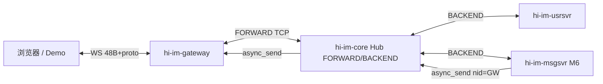

# hi-im-gateway 技术设计文档

> **组件**：hi-im-gateway（Go + Gin + WebSocket + hubclient）  
> **层级**：L3 接入服务（**独立部署**）  
> **必嗨等价**：`src/golang/exec/websocket`（LSND-WS）  
> **版本**：v0.1 · 2026-07-03  
> **生态**：对应 [hi-im/doc/hi-im-档C技术方案设计.md](https://github.com/sunchao1/hi-im/blob/main/doc/hi-im-档C技术方案设计.md) **生态 M5**（群聊第二段 fan-out **M6**）

---

## 1. 定位与边界

### 1.1 是什么

**hi-im-gateway** 是浏览器 / 客户端的 **WebSocket 接入层**，职责：

| 职责 | 说明 |
|------|------|
| **WS 长连接** | 二进制帧：`[ MesgHeader 48B \| protobuf body ]`（与必嗨一致） |
| **上行转发** | 客户端 → 填 `cid/nid` → hubclient **FORWARD** `AsyncSend` → Hub **publish** → BACKEND 业务 |
| **下行投递** | Hub **async_send** → gateway `RegisterHandler` → 查 **ChatTab** → 写回 WS |
| **会话表 ChatTab** | 进程内 `sid/cid ↔ Conn`；M6 **`ImGroup`**（gid→成员连接，第二段 fan-out） |
| **HTTP 运维** | Gin：`/healthz`、`/readyz`、`/metrics`（M8+）、静态 Demo 代理（可选） |

**数据平面**（档 C §3）：

```text
浏览器 ──WS──► gateway ──hubclient FORWARD──► Hub.publish ──► usrsvr / msgsvr …
usrsvr ──hubclient BACKEND──► Hub.async_send(destNid=gatewayNid) ──► gateway ──WS──► 浏览器
```

gateway **只连 FORWARD**（`:28888`），**不**连 BACKEND。

### 1.2 不是什么

| 不是 | 说明 |
|------|------|
| **HTTP 注册 / iplist** | 属 **hi-im-usrsvr**（客户端先 HTTP 拿 sid/token，再连 WS） |
| **ONLINE 业务逻辑** | token 校验、Redis、AllocSeq 在 **usrsvr** |
| **群聊第一段 fan-out** | `gid→nid` 在 **msgsvr**（M6） |
| **SID 发号** | **seqsvr** |
| **Hub 实现** | **hi-im-core** |
| **对外 SDK** | 客户端走 WS + usrsvr HTTP |

### 1.3 与相邻组件分工

| 组件 | 关系 |
|------|------|
| **hi-im-hubclient** | FORWARD：`AsyncSend` 上行；`RegisterHandler` 下行 |
| **hi-im-api** | header 编解码、proto、cmd 常量 |
| **hi-im-usrsvr** | ONLINE/OFFLINE/PING 的 **BACKEND** 处理；iplist 返回本 gateway 地址 |
| **hi-im-msgsvr** | M6：SUB `GROUP-CHAT`，按 Redis `gid→nid` **async_send 到各 gateway NID** |
| **hi-im（主仓）** | M5 Compose：`gateway×2` + `demo` profile；M6 群聊冒烟 |

---

## 2. 在生态中的位置



| 里程碑 | 本仓交付 | 验收 |
|--------|----------|------|
| **M5** | WS + ONLINE 全链路 + 双实例 | 浏览器注册上线；可选双窗口 echo |
| **M6** | ChatTab **ImGroup** + `GROUP-CHAT` 第二段 fan-out | 双窗口群聊（依赖 msgsvr） |
| **M8** | HPA、分片 NID、Prometheus | Ingress 固定 wss |

---

## 3. 必嗨对照

### 3.1 框架与模块

| 必嗨 websocket | hi-im-gateway |
|----------------|---------------|
| `lib/lws` WebSocket | **gorilla/websocket** 或 **nhooyr.io/websocket** |
| `lib/rtmq` frwder（FORWARD） | **hi-im-hubclient**（`HIIM_FORWARD_ADDR`） |
| `lib/chat_tab` | **`internal/chattab`** |
| beego（无独立 HTTP 路由） | **Gin**（health/metrics） |
| 进程 NID / Nation / Opid | `HIIM_NID`、`HIIM_SHARD_ID` |

### 3.2 上下行 Handler 映射

**上行**（`MesgRegister` → `internal/ws/uplink`）：

| CMD | 必嗨 | hi-im M5 |
|-----|------|----------|
| `0x0101` ONLINE | `LsndMesgOnlineHandler` | ✅ |
| `0x0103` OFFLINE | `LsndMesgOfflineHandler` | ✅ |
| `0x0105` PING | `LsndMesgPingHandler` | ✅ |
| `0x030B` GROUP_CHAT | `LsndMesgCommHandler` 转发 | 转发 ✅；**第二段 fan-out M6** |
| 其他业务 cmd | `LsndMesgCommHandler` | M5 按需转发；未登录踢线 |

**下行**（`UpMesgRegister` → `internal/hub/downlink`）：

| CMD | 必嗨 | hi-im M5 |
|-----|------|----------|
| `0x0102` ONLINE_ACK | `LsndUpMesgOnlineAckHandler` | ✅ |
| `0x0106` PONG | 随 PING 本地或下行 | ✅ |
| KICK / SUB_ACK | 对应 handler | ✅ 最小集 |
| `0x030B` GROUP_CHAT | `LsndUpMesgGroupChatHandler` + ImGroup | **M6** |

---

## 4. 连接与会话模型

### 4.1 连接状态

对齐必嗨 `LsndConnExtra`：

| 状态 | 含义 | 允许的操作 |
|------|------|------------|
| **READY** | WS 已建立，未 ONLINE | 收 ONLINE |
| **CHECK** | ONLINE 已转发，等 ACK | 等待 usrsvr |
| **LOGIN** | ONLINE_ACK 成功 | 业务上行、PING |
| **LOGOUT** | 主动/被动下线 | 关闭 WS |

每个连接分配进程内唯一 **`cid`**（uint64，单调递增）；**`sid`** 来自注册 HTTP，在 ONLINE 帧 body 中。

### 4.2 ChatTab（会话索引）

```text
SessionSetParam(sid, cid, conn)     // ONLINE 时建立
SessionGetParam(sid, cid)           // 下行 ACK 查找
GetCidBySid(sid)                    // 单连接 sid（冲突踢线）
SessionDel(sid, cid)                // 连接关闭
```

**M6 ImGroup**（对齐 `lib/chat_tab/chat.go`）：

```text
ImGroupJoin(gid, sid, cid)          // JOIN_ACK 解析 Ok:gid 后
TravImGroupSession(gid, callback) // GROUP-CHAT 第二段：同 gid 所有成员连接
ImGroupQuit(gid, sid, cid)          // 退群清理
```

### 4.3 序列号

- 上行：校验 `head.seq` 单调（`conn.SetSeq`），防重放。
- ONLINE_ACK：用 ack.seq 初始化会话 seq（必嗨 `LsndUpMesgOnlineAckHandler`）。

---

## 5. 核心流程

### 5.1 端到端上线（M5）

```text
1. 客户端 GET usrsvr /im/register        → sid
2. 客户端 GET usrsvr /im/iplist          → gateway WS URL + token
3. 客户端 WebSocket 连接 gateway
4. 客户端发 ONLINE（header.cid 占位，body 含 uid/sid/token）
5. gateway：SessionSetParam；head.cid/nid ← 本连接；FORWARD AsyncSend
6. Hub.publish → usrsvr：校验 token、AllocSeq、写 Redis
7. usrsvr AsyncSend ONLINE_ACK → Hub → gateway nid
8. gateway：RegisterHandler 收到 ONLINE_ACK → conn=LOGIN → WS 下发 ACK
```

### 5.2 通用上行（已 LOGIN）

对齐 `LsndMesgCommHandler`：

```text
1. 校验 conn 状态 LOGIN
2. head.SetCid(conn.cid); head.SetNid(HIIM_NID)
3. header.Pack 大端
4. hubclient.AsyncSend(cmd, 0, payload)   // FORWARD publish，destNid 由 Hub 桥接
```

### 5.3 通用下行

对齐 `LsndUpMesgCommHandler`：

```text
1. hubclient Handler(cmd, origNid, payload)
2. head = header.Unmarshal(payload)
3. cid = head.cid 或 ChatTab.GetCidBySid(head.sid)
4. ws.Send(cid, payload)
```

### 5.4 OFFLINE / 连接关闭

- 客户端 OFFLINE 或 WS close → `offline_notify` 转发 OFFLINE 到 Hub（可选，M5 最小可仅本地清理）。
- `SessionDel` + ChatTab 清理；M6 同时 `ImGroupQuit`。

### 5.5 M5 echo / 单播（可选冒烟）

| 方式 | 说明 |
|------|------|
| **PING/PONG** | 验证 WS 双向 |
| **本地 echo** | 对指定测试 cmd 原样回写（仅 dev smoke，非生产） |
| **Hub unicast** | 需 BACKEND 业务或测试桩 async_send 到 gateway NID（M3 桩可复用） |

**M5 不验收 GROUP-CHAT fan-out**（档 C §11.5）。

### 5.6 M6 群聊第二段（预览）

```text
msgsvr ──async_send(nid=20001)──► Hub ──► gateway
  → LsndUpMesgGroupChatHandler
  → TravImGroupSession(gid, sendToEachConn)
  → 各成员浏览器收到 GROUP-CHAT
```

**为何需要 ImGroup**：下行包头 `sid` 常为**发送方** sid；不能只按 sid 找单连接。

---

## 6. hubclient 集成（FORWARD）

### 6.1 配置

```bash
HIIM_FORWARD_ADDR=hub:28888          # 仅 FORWARD
HIIM_NID=20001                       # 全局唯一；双窗口 Demo 用 20001/20002
HIIM_SHARD_ID=0                      # M8 分片
HIIM_AUTH_USER=websocket             # 与 Hub 配置一致
HIIM_AUTH_PASS=***
HIIM_SUB_CMDS=0x0102,0x0106,...      # 下行 SUB 列表（M5 见 §6.2）
```

**禁止**设置 `HIIM_BACKEND_ADDR` 为本服务默认值（易混）。

### 6.2 M5 下行 SUB 最小集

```text
0x0102  ONLINE_ACK
0x0106  PONG          （若 PING 走 usrsvr 回包则含 0x0106）
KICK    （cmd 见 hi-im-api）
0x0107  SUB_ACK       （若客户端 SUB）
```

M6 追加：`0x030B GROUP_CHAT`、`0x0306 GROUP_JOIN_ACK`、`0x030x NTF` 等。

### 6.3 启动顺序

```text
1. hubclient.Start + WaitReady（FORWARD AUTH+SUB）
2. RegisterHandler 注册下行表
3. Gin 启动 + WS Upgrade 路由
4. 就绪：/readyz = hubclient.Ready() && WS server up
```

---

## 7. WebSocket 接入

### 7.1 路由

| 路径 | 方法 | 说明 |
|------|------|------|
| `/ws` 或 `/im/ws` | GET Upgrade | 主 IM 二进制通道 |
| `/healthz` | GET | 存活 |
| `/readyz` | GET | hubclient Ready |
| `/metrics` | GET | Prometheus（M8+） |

### 7.2 帧格式

- **Binary Message** only；payload = 完整 IM 帧（48B 头 + body）。
- 与必嗨 `websocket-protobuf.html` Demo 对齐。
- 半包：按消息边界读整帧（WS 一帧 = 一条 IM 消息）。

### 7.3 并发模型

```text
每连接：
  read goroutine  → 解析 cmd → uplink dispatch
  write channel   → 串行写 WS（避免 concurrent write）
hubclient：
  复用 hubclient 内部 worker 收下行
```

---

## 8. 仓库目录结构（规划）

```text
hi-im-gateway/
├── LICENSE
├── README.md
├── go.mod
├── cmd/gateway/main.go
├── internal/
│   ├── config/config.go
│   ├── http/
│   │   ├── router.go              # Gin + WS upgrade
│   │   └── health.go
│   ├── ws/
│   │   ├── server.go              # 连接生命周期
│   │   ├── conn.go                # cid/sid/status/seq
│   │   └── uplink/
│   │       ├── dispatch.go        # cmd → handler
│   │       ├── online.go
│   │       ├── offline.go
│   │       └── ping.go
│   ├── hub/
│   │   ├── client.go              # hubclient FORWARD 封装
│   │   └── downlink/
│   │       ├── dispatch.go
│   │       ├── online_ack.go
│   │       └── kick.go
│   └── chattab/
│       ├── session.go             # sid/cid 表
│       └── imgroup.go             # M6
├── deploy/docker/Dockerfile
├── test/
│   ├── chattab_test.go
│   ├── ws_online_integration_test.go
│   └── group_fanout_test.go       # M6
├── doc/
├── Makefile
└── .github/workflows/ci.yml
```

---

## 9. 依赖

```go
module github.com/sunchao1/hi-im-gateway

go 1.22

require (
    github.com/sunchao1/hi-im-api v0.1.0
    github.com/sunchao1/hi-im-hubclient v0.1.0
    github.com/gin-gonic/gin v1.10.x
    github.com/gorilla/websocket v1.5.x
)
```

| 依赖 | 用途 |
|------|------|
| hi-im-api | header、proto、cmd |
| hi-im-hubclient | FORWARD |
| gin | HTTP |
| gorilla/websocket | WS |

**M5 不依赖**：seqsvr gRPC、Redis（会话在 usrsvr）、msgsvr。

---

## 10. 配置与环境变量

| 变量 | 默认 | 说明 |
|------|------|------|
| `HIIM_HTTP_LISTEN` | `:8080` | Gin（含 WS） |
| `HIIM_WS_PATH` | `/ws` | Upgrade 路径 |
| `HIIM_FORWARD_ADDR` | — | Hub FORWARD |
| `HIIM_NID` | `20001` | 本实例 NID |
| `HIIM_SHARD_ID` | `0` | M8 分片 |
| `HIIM_AUTH_USER` / `HIIM_AUTH_PASS` | — | Hub 认证 |
| `HIIM_SUB_CMDS` | §6.2 | 下行 SUB |
| `HIIM_MAX_CONN` | `100000` | 连接上限（软限） |
| `HIIM_USRSVR_HTTP` | — | 可选：gateway 内置反向代理 Demo 用 |

---

## 11. 部署

### 11.1 Compose（hi-im 主仓 M5+）

```text
profile biz:    gateway（×2：NID 20001/20002）
profile demo:   demo-web 静态页
depends_on:     hub, usrsvr, redis, seqsvr
```

| 项 | 建议 |
|----|------|
| 副本 | M5 **2 副本**（双窗口 Demo）；每副本 **不同 HIIM_NID** |
| HPA | M8+ on CPU / 连接数 |
| Ingress | M8：`wss://im.example.com` → Service gateway |

### 11.2 扩缩容（档 C §10）

| 组件 | 策略 |
|------|------|
| **gateway** | ✅ 水平扩展；每 Pod 独立 NID |
| hi-im-hub | ⚠️ 按 shard 增删 |
| msgsvr SUB=single | ⚠️ 与 gateway 扩展独立 |

多 gateway 时 usrsvr **iplist** 返回多地址；msgsvr M6 按 `gid→nid` 精确投递。

---

## 12. 测试策略

| 测试 | 目的 |
|------|------|
| `chattab_test` | sid/cid 映射、冲突踢线 |
| `ws_online_integration` | WS ONLINE → Hub → usrsvr → ONLINE_ACK → LOGIN |
| `ping_test` | PING/PONG |
| `group_fanout_test`（M6） | ImGroup 两连接同 gid 均收到 GROUP-CHAT |
| 主仓 smoke | M5：`m5-ws-online.sh`（规划） |

---

## 13. 生态 M5 验收（本仓库）

| 项 | 标准 |
|----|------|
| WS | Binary IM 帧握手；`/readyz` 200 |
| 注册链 | Demo：register → iplist → WS → ONLINE → LOGIN |
| hubclient | FORWARD Ready；上行 publish 可达 usrsvr |
| 双实例 | 两 gateway 不同 NID，均可 ONLINE |
| 边界 | **不**验收 GROUP-CHAT 群聊 fan-out（**M6**） |

**跨仓 M5**（档 C §11.3）：浏览器连 WS、注册上线；可选双窗口 echo/单播。

---

## 14. 里程碑节奏

| 阶段 | 本仓 | 说明 |
|------|------|------|
| **M5** | WS + ONLINE + 双 gateway + demo | 依赖 M4 usrsvr iplist/token |
| **M6** | ImGroup + GROUP-CHAT 第二段 | 依赖 msgsvr 第一段 |
| **M8** | HPA、Prometheus、shard NID | 主仓 K8s |

**M4 之前**不启动 gateway 里程碑验收（无 iplist/ONLINE 闭环）。

---

## 15. 风险与决策

| ID | 决策 | 理由 |
|----|------|------|
| G1 | **FORWARD only** | 档 C 接入层走 publish；BACKEND 给业务 |
| G2 | beego → **Gin** + 标准 WS 库 | 档 C §7.1 |
| G3 | M5 **不做** ImGroup 群 fan-out | 防与 M6 msgsvr 混淆 |
| G4 | ChatTab **进程内** | 与必嗨一致；换机后靠 gid→nid 重新投递 |
| G5 | listend（C TCP）**延后** | 档 C D6；浏览器 Demo 以 WS 为主 |
| G6 | 双 gateway 用 **不同 NID** | Hub async_send 精确路由 |

| 风险 | 缓解 |
|------|------|
| WS 与 hubclient 并发写 | 每连接 write channel |
| 多副本 SUB 重复 | gateway 下行按 **nid** 投递，非 broadcast SUB |
| token 未就绪 | M5 硬依赖 usrsvr iplist |

---

## 16. 参考

| 文档 / 代码 | 路径 |
|-------------|------|
| 档 C 总方案 | [hi-im/doc/hi-im-档C技术方案设计.md](https://github.com/sunchao1/hi-im/blob/main/doc/hi-im-档C技术方案设计.md) |
| hi-im-usrsvr | [hi-im-usrsvr/doc/技术设计文档.md](https://github.com/sunchao1/hi-im-usrsvr/blob/main/doc/技术设计文档.md) |
| hi-im-hubclient | [hi-im-hubclient/doc/技术设计文档.md](https://github.com/sunchao1/hi-im-hubclient/blob/main/doc/技术设计文档.md) |
| 必嗨 websocket | `beehive-im/src/golang/exec/websocket/` |
| 群聊 Demo 导读 | `beehive-im/doc/群聊Demo源码导读.md` |
| 主仓 Compose | [hi-im/doc/技术设计文档.md](https://github.com/sunchao1/hi-im/blob/main/doc/技术设计文档.md) §6 |

---

*文档版本：2026-07-03 · hi-im-gateway v0.1-draft*
