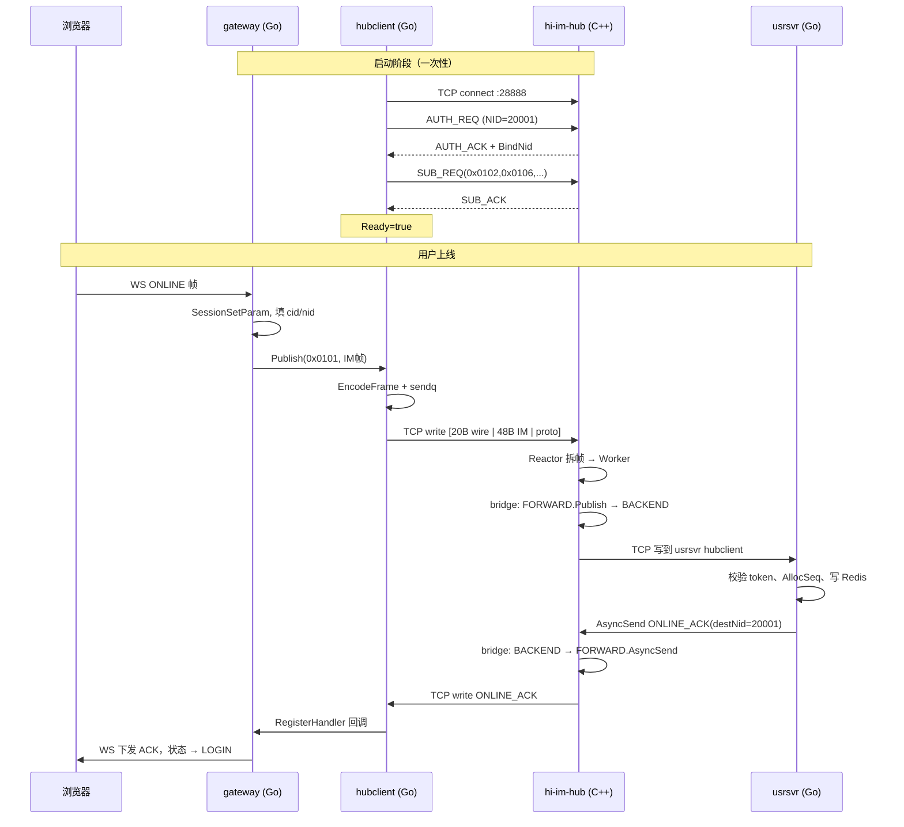

# 解析 hubclient.AsyncSend

> 说明 gateway 如何通过 `hubclient.AsyncSend` 与 C++ hi-im-hub 通信，以及数据如何到达后端业务服务。  
> 涉及仓库：`hi-im-gateway`、`hi-im-hubclient`、`hi-im-core`

---

## 1. 核心结论

**`AsyncSend` 本身不会建立 TCP 连接。**

连接在 `hubClient.Start()` 阶段就已经建好（`net.Dial` + AUTH + SUB 握手）。`AsyncSend` 只是在 **Ready 状态** 下，把一帧二进制数据异步写入已有的 TCP 长连接。

gateway 与 C++ Hub 之间 **不是 gRPC，也不是 CGO**，而是：

```text
标准 TCP + bus wire v1 自定义二进制协议（20 字节帧头 + payload）
```

Go 的 `hi-im-hubclient` 和 C++ 的 `hi-im-hub` 各自独立实现同一套 wire 格式，运行时通过 TCP 互通。

---

## 2. 协议栈：两层头

发送一帧业务数据时，实际线上存在 **两层 header**，不要混淆：

| 层 | 长度 | 定义方 | 编解码者 | 说明 |
|----|------|--------|----------|------|
| **bus wire** | 20B | hi-im-core 规范 | hubclient ↔ hi-im-hub | TCP 传输帧头 |
| **IM MesgHeader** | 48B | hi-im-api | gateway / usrsvr 等 L3 | 业务路由头，在 payload 内 |

线上字节布局：

```text
┌──────────────── wire header 20B ────────────────┬──────── payload ────────┐
│ type │ nid │ flag │ length │ chksum            │  IM 48B 头 │ protobuf   │
└─────────────────────────────────────────────────┴─────────────────────────┘
```

- `flag = 0 (SYS)`：系统帧（AUTH / SUB / KPALIVE）
- `flag = 1 (EXP)`：业务帧（AsyncSend / Publish 路由的数据）

hubclient **不解析 IM 头内容**，payload 对传输层是 opaque 字节流；Hub 仅在 bridge 下行时读取 IM 头中的 `dest_nid` 做路由。

wire 帧头字段（大端序）与 Go/C++ 常量一致：

| 字段 | 含义 |
|------|------|
| `type` | 命令字：系统 cmd 或业务 cmd（如 `0x0101` ONLINE） |
| `nid` | 节点 ID，AUTH 绑定与路由用 |
| `flag` | `0=SYS`，`1=EXP` |
| `length` | payload 字节数 |
| `chksum` | 固定魔数 `0x1FE23DC4` |

---

## 3. 连接何时建立（Start 阶段）

gateway 启动流程（`cmd/gateway/main.go`）：

```text
hub.NewClient()           构造 hubclient，配置 Addr/NID/Auth/Subscribe
hubClient.Start(ctx)      启动 Session.Run() 后台 goroutine
hubClient.WaitReady()     阻塞等待 AUTH + SUB 完成
```

`Start()` 内部启动 `conn.Session.Run()`，循环执行：

```text
1. net.Dial("tcp", HIIM_FORWARD_ADDR)     连接 C++ Hub FORWARD 端口（默认 :28888）
2. handshake()                            AUTH → SUB
3. markReady()                            Ready = true
4. 启动 recvLoop / sendLoop / workerLoop
5. 断线 → 指数退避重连 → 重新 AUTH + SUB
```

### 3.1 握手时序

```text
Go hubclient                          C++ hi-im-hub (Reactor)
  │── TCP connect ──────────────────────►│  Listener accept，分配 sid
  │── AUTH_REQ (wire, flag=SYS) ────────►│  校验 user/pass
  │                                      │  Router.BindNid(nid → sid, reactor_idx)
  │◄── AUTH_ACK ─────────────────────────│
  │── SUB_REQ(0x0102) ─────────────────►│  Router.Subscribe(cmd, subscriber)
  │── SUB_REQ(0x0106) ... ──────────────►│
  │◄── SUB_ACK ──────────────────────────│
  │  状态 → Ready                         │
  │◄══ KPALIVE 每 30s ══════════════════►│
```

gateway 侧 SUB 命令集来自 `HIIM_SUB_CMDS`，默认：

```text
0x0102, 0x0106, 0x0110, 0x0302, 0x0306, 0x030B, 0x030C
```

对应 ONLINE_ACK、PONG、KICK、群聊相关 ACK 等下行帧。

### 3.2 相关代码

| 环节 | 仓库 | 文件 |
|------|------|------|
| gateway 启动 hubclient | hi-im-gateway | `cmd/gateway/main.go` |
| TCP Dial + 握手 | hi-im-hubclient | `pkg/hubclient/conn/session.go` |
| AUTH/SUB 编码 | hi-im-hubclient | `pkg/hubclient/wire/sys.go` |
| C++ 收 AUTH、BindNid | hi-im-core | `src/hub/reactor.cpp` |
| SUB 路由表 | hi-im-core | `src/hub/router.cpp` |

---

## 4. AsyncSend 做了什么

### 4.1 gateway 调用链

gateway 上行不直接调 `AsyncSend`，而是封装为 `Publish`：

```go
// internal/hub/client.go
func (c *Client) Publish(cmd uint32, payload []byte) error {
    return c.inner.AsyncSend(cmd, 0, payload)
}
```

uplink handler（如 ONLINE）拼好完整 IM 帧后调用 `Publish`：

```text
uplink.OnlineHandler.Handle
  → repack(header + body)          填充 cid/nid
  → hubClient.Publish(cmd, frame)
  → hubclient.AsyncSend(cmd, 0, frame)
```

### 4.2 hubclient.AsyncSend 内部步骤

```go
// pkg/hubclient/client.go
func (c *Client) AsyncSend(cmd, destNid uint32, payload []byte) error {
    nid := c.cfg.NID
    if destNid > 0 {
        nid = destNid
    }
    frame := wire.EncodeFrame(cmd, nid, wire.FlagExp, payload)
    return c.session.EnqueueSend(frame, c.cfg.SendTimeout)
}
```

步骤拆解：

1. **确定 wire.nid**
   - `destNid == 0`：wire.nid = 本进程 NID（gateway 上行、msgsvr publish）
   - `destNid > 0`：wire.nid = 目标 NID（Hub async_send 单播语义）
2. **编码 wire 帧**：`EncodeFrame(cmd, nid, FlagExp, payload)` → `[20B header | payload]`
3. **异步入队** `sendq`（容量默认 50000，超时默认 1s）
4. **sendLoop** 从 `sendq` 取出，调用 `conn.Write()` 写入 TCP

未 Ready 时返回 `ErrNotReady`；队列满时返回 `ErrSendTimeout`。

### 4.3 sendLoop 与 recvLoop

Session 在 TCP 连接就绪后启动三个 goroutine：

| goroutine | 职责 |
|-----------|------|
| **recvLoop** | 读 TCP → 拆 wire 帧 → 系统帧本地处理 / 业务帧入 recvq |
| **sendLoop** | 消费 sendq（业务帧）+ sysq（KPALIVE 等系统帧）→ 写 TCP |
| **workerLoop** | 消费 recvq → 调用 RegisterHandler 注册的回调 |

---

## 5. C++ Hub 如何收到数据

hi-im-hub 采用 **Reactor + Worker + Distributor** 流水线：

```text
Listener accept
  → Reactor 读 TCP、拆帧
  → flag=SYS  → Reactor 直接处理（AUTH/SUB/KPALIVE）
  → flag=EXP  → EnqueueInbound → RecvQueue(MPSC)
  → Worker  Pop → 按 cmd 找 Handler
  → Handler 处理（bridge / 业务）
```

业务帧入队（`src/hub/reactor.cpp`）：

```cpp
void Reactor::EnqueueInbound(Session& session, FrameView frame) {
    msg.sid = session.sid;
    msg.type = /* wire.type */;
    msg.flag = /* wire.flag */;
    msg.payload = frame.payload;   // 含 48B IM 头 + protobuf
    // Push RecvQueue → 唤醒 Worker
}
```

---

## 6. Hub 双平面与 bridge 桥接

hi-im-hub 有两个 TCP 平面：

| 平面 | 默认端口 | 典型连接方 | 作用 |
|------|----------|------------|------|
| **FORWARD** | 28888 | hi-im-gateway | 接入层上行/下行 |
| **BACKEND** | 28889 | usrsvr / msgsvr / chatroom | 业务服务 |

gateway 的 `AsyncSend` 发到 **FORWARD 平面**。C++ **bridge** 负责两个平面之间的转发（`src/hub/bridge.cpp`）：

### 6.1 上行：FORWARD → BACKEND（Publish）

gateway 发来的业务帧，由 FORWARD 默认 handler 转投 BACKEND：

```cpp
void ForwardUplinkHandler(HubContext& ctx, const InboundMessage& msg) {
    HubContext* peer = ctx.Peer();   // BACKEND 平面
    peer->Publish(msg.type, msg.payload.data(), msg.payload.size());
}
```

`Publish` 查 **SUB 路由表**（谁 SUB 了这个 cmd）：

```cpp
Status Publish(HubContext& ctx, uint32_t cmd, const uint8_t* data, std::size_t len) {
    const auto subs = ctx.GetRouter().FindSubscribers(cmd);
    for (const auto& sub : subs) {
        // 为每个订阅者编码 wire 帧，入 DistQueue
        EncodeFrame(cmd, sub.nid, kFlagExp, payload);
        // DistQueue → Distributor → SendQueue → Reactor → TCP 写到订阅者
    }
}
```

例如 ONLINE（`0x0101`）：
- usrsvr 启动时连 BACKEND，SUB 了 `0x0101`
- Hub Publish 找到 usrsvr，通过 TCP 把同一 payload 发给 usrsvr 的 hubclient

### 6.2 下行：BACKEND → FORWARD（AsyncSend）

msgsvr / usrsvr 下行时，Hub 读 IM 头中的 `dest_nid`，单播到 gateway：

```cpp
void BackendDownlinkHandler(HubContext& ctx, const InboundMessage& msg) {
    const uint32_t dest_nid = ReadImDestNid(msg);   // IM 头 offset 24
    peer->AsyncSend(msg.type, dest_nid, msg.payload.data(), msg.payload.size());
}
```

C++ `AsyncSend` 查 **NID 路由表**（AUTH 时 BindNid 写入）：

```cpp
Status AsyncSend(HubContext& ctx, uint32_t cmd, uint32_t dest_nid, ...) {
    const auto route = ctx.GetRouter().FindNidRoute(dest_nid);
    // 编码 wire 帧，入 DistQueue → TCP 写到 gateway hubclient
}
```

### 6.3 两张路由表

| 路由表 | 写入时机 | 查询 API | 用途 |
|--------|----------|----------|------|
| **SUB 表** | SUB_REQ | `FindSubscribers(cmd)` | Publish 广播 |
| **NID 表** | AUTH 成功 | `FindNidRoute(nid)` | AsyncSend 单播 |

---

## 7. 完整 ONLINE 链路



---

## 8. Publish vs AsyncSend 语义对照

hubclient 对外只有一个发送 API：`AsyncSend`。gateway 封装为 `Publish` 是语义别名。

| 调用方 | hubclient 调用 | wire.nid | C++ Hub 侧行为 |
|--------|----------------|----------|----------------|
| gateway 上行 | `AsyncSend(cmd, 0, frame)` | 本进程 NID | FORWARD → bridge → BACKEND **Publish** |
| usrsvr 下行 | `AsyncSend(cmd, gatewayNid, frame)` | 目标 gateway NID | BACKEND → bridge → FORWARD **AsyncSend** |
| msgsvr fan-out | `AsyncSend(cmd, gatewayNid, frame)` | 各 gateway NID | 同上 |

| 方向 | wire.flag | wire.nid | wire.type |
|------|-----------|----------|-----------|
| Proxy 上行 | EXP(1) | **本进程 NID** | 业务 cmd |
| Hub async_send 下行 | EXP(1) | **目的 NID** | 业务 cmd |

---

## 9. 断线重连

`Session.Run()` 在 TCP 错误或 KPALIVE 超时后：

```text
1. 关闭当前 conn
2. resetReady()              Ready = false
3. 指数退避（1s → 30s + jitter）
4. 重新 Dial → AUTH → SUB → markReady()
5. 可选 OnReconnect 回调
```

重连期间 `AsyncSend` / `Publish` 返回 `ErrNotReady`。gateway 应在 `WaitReady` 成功后再对外提供 WS 服务（`/readyz` 检查 hubclient.Ready()）。

---

## 10. 常见问题

### Q: AsyncSend 是 gRPC 或 CGO 调 C++ 吗？

不是。纯 Go 标准库 `net.Dial` + `conn.Write`，与 C++ Hub 通过 **TCP + bus wire v1** 二进制协议通信。两边独立实现同一帧格式，无 CGO 绑定。

### Q: gateway 的 AsyncSend 数据最终到哪里？

C++ Hub 是 **消息路由器**，不是 ONLINE 等业务逻辑的处理器：

```text
gateway AsyncSend → C++ FORWARD → bridge Publish → usrsvr (Go BACKEND)
```

usrsvr 收到后由自身 RegisterHandler 处理业务，再 AsyncSend 下行 ACK 回 gateway。

### Q: 为什么 hubclient 叫 AsyncSend，gateway 却用 Publish？

- hubclient 层：统一 API 名称，兼容必嗨 `rtmq_proxy.AsyncSend`
- gateway 层：`Publish` 表达「上行广播到 Hub」的语义，`destNid` 固定为 0
- C++ Hub 层：`Publish` = 查 SUB 表 fan-out；`AsyncSend` = 查 NID 表单播

### Q: payload 里已经填了 IM.nid，为什么还要 wire.nid？

两层职责不同：

- **wire.nid**：TCP 会话层路由（AUTH 绑定、AsyncSend 查 NID 表）
- **IM header.nid**：业务层目标节点（msgsvr fan-out 时填 gateway NID；bridge 下行读此字段）

---

## 11. 代码入口速查

| 环节 | 仓库 | 文件 |
|------|------|------|
| gateway 调用 Publish | hi-im-gateway | `internal/hub/client.go` |
| gateway 上行 ONLINE | hi-im-gateway | `internal/ws/uplink/online.go` |
| hubclient AsyncSend | hi-im-hubclient | `pkg/hubclient/client.go` |
| wire 帧编码 | hi-im-hubclient | `pkg/hubclient/wire/encode.go` |
| TCP 连接 + 握手 | hi-im-hubclient | `pkg/hubclient/conn/session.go` |
| C++ wire 帧定义 | hi-im-core | `include/hiim/wire/header.hpp` |
| C++ 收 TCP / AUTH | hi-im-core | `src/hub/reactor.cpp` |
| FORWARD↔BACKEND 桥 | hi-im-core | `src/hub/bridge.cpp` |
| Publish / AsyncSend | hi-im-core | `src/hub/context_impl.cpp` |
| SUB / NID 路由表 | hi-im-core | `src/hub/router.cpp` |

---

## 12. 相关文档

- [gateway逻辑汇总](./gateway逻辑汇总.md)
- [技术设计文档](./技术设计文档.md)
- [hi-im-hubclient 技术设计文档](https://github.com/sunchao1/hi-im-hubclient/blob/main/doc/技术设计文档.md)
- [hi-im-core bus wire v1 协议规范](https://github.com/sunchao1/hi-im-core/blob/main/doc/协议规范-bus-wire-v1.md)
